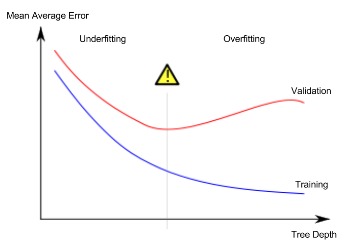

# Intro to Machine Learning
Based on the kaggle tutorial ["Introduction to Machine Learning"](https://www.kaggle.com/learn/intro-to-machine-learning) by Dan Beaker

## 1. How models work
-	Decision Tree—example: price based on a number of factors, each representing one child of an internal node.
-	The predicted price for the house is at the bottom of the tree. The point at the bottom where we make a prediction is called a leaf.
-	The splits and values at the leaves will be determined by the data, so it's time for you to check out the data you will be working with.


## 2. Using Pandas to get familiar with your data
- The most important part of the Pandas library is the DataFrame. A DataFrame holds the type of data you might think of as a table. This is similar to a sheet in Excel, or a table in a SQL database.
```py
# import pandas, the tool of interest
import pandas as pd

file_path = "path/to/data.csv"
# convert the file to the data frame format
data = pd.read_csv(file_path)

#print a summary of the data as a table
data.describe()

```
*In the resulting table:* <br>
| column name | description | special info |
| ----        |   --------- | ------------ |
count | num valid data | data can be not valid if they are empty, or irrelavent -- size of 2nd room in a 1BHK house.
mean | average
min | smallest
`number`% | `number`-th percentile values
max | largest value

### Think About Your Data
The newest house in your data isn't that new. A few potential explanations for this:
- They haven't built new houses where this data was collected.
- The data was collected a long time ago. Houses built after the data publication wouldn't show up.


## 3. Your First Machine Learning Model
<U> Goal:</U>
Your dataset had too many variables to wrap your head around, or even to print out nicely. Learn how can you pare down this overwhelming amount of data to something you can understand?

### To choose variables/columns, we'll need to see a list of all columns in the dataset. That is done with the columns property of the DataFrame (the bottom line of code below)
```py
data = pd.read_csv(data_path)
data.columns
```
*Output format*
```
Index(['Suburb', 'Address', 'Rooms', 'Type', 'Price', 'Method', 'SellerG',
       'Date', 'Distance', 'Postcode', 'Bedroom2', 'Bathroom', 'Car',
       'Landsize', 'BuildingArea', 'YearBuilt', 'CouncilArea', 'Lattitude',
       'Longtitude', 'Regionname', 'Propertycount'],
      dtype='object')
```

### Two ways to select a subset of our data (many more exist, but we don't care about that here):
1. Select the prediction target using `dot notation` (the answer you expect the ML model to give):
    - ```y = data.<column_name>```
    - `y` - The prediction target
    - The column is stored in a `Series` datatype, which is essentially a single column `DataFrame`.


2. Select the features [think model inputs correspoding to the output of interest.]
    - make a list of the column names of your features
        ```features = ['col1', 'col2', 'col3'] ```
    - by convention, this is called `X`
    - ```X = data[features]``` 

### Building a model
- will be using `scikit-learn`'s `DecisionTreeRegressor` here.

***Steps to build a model:***
|Sno.   | Name      | description
| ---   | ---       | --- 
| ----- | -----     | **Before, and the process of, creating a model**
1       | Define    | What type of model will it be? Decision tree? Parameters, etc.
2       | Fit       | Capture pattents form provided data -- the actual training!
| ----- | -----     | **Post Creation**
3       | Predict   | Using the model to, you know, predict the correct answer.
4       | Evaluate  | Ask yourself, how good is the model?

**Example:**
```py
from sklearn.tree import DecisionTreeRegressor

# Define model. Specify a number for random_state to ensure same results each run
melbourne_model = DecisionTreeRegressor(random_state=1)

# Fit model
melbourne_model.fit(X, y)
```
<U>Note:</U> 
Many machine learning models allow some randomness in model training. Specifying a number for random_state ensures you get the same results in each run. This is considered a good practice. You use any number, and model quality won't depend meaningfully on exactly what value you choose.

==> We now have a fitted model that we can use to make predictions.

```py
print("The predictions are")
print(melbourne_model.predict(predictMe.head()))
```


## 4. Model Validation
- You'll want to evaluate almost every model you ever build. In most (though not all) applications, the relevant measure of model quality is predictive accuracy. In other words, will the model's predictions be close to what actually happens.

- Don't use the same data for training and testing (duh!)

- You'd first need to summarize the model quality into an understandable way. 
    - If you compare predicted and actual home values for 10,000 houses, you'll likely find mix of good and bad predictions. Looking through a list of 10,000 predicted and actual values would be pointless. 
    - *We need to summarize this into a single metric.*


### Using MAE (Mean Absolute Error) for model validation
- Measures the average difference between the predicted and actual values
- `Error := actual - predicted`
- Gives info along the lines of "On average, our predictions are off by about `X`."

**Syntax**:
```py
from sklearn.metrics import mean_absolute_error as mae

predicted_values = model.predict(X)
mae(correct_values, predicted_values)

```

### Independent training and testing datasets
- Since models' practical value come from making predictions on new data, we measure performance on data that wasn't used to build the model. The most straightforward way to do this is to exclude some data from the model-building process, and then use those to test the model's accuracy on data it hasn't seen before. This data is called ***validation data***.
    - check section on under and overfitting to know why the accuracy can differ quite a bit between the training and validation datasets.
    - TLDR: Features that affect nothing in the real world might be common among the datapoints of certain characteristics, so the model assumes that those characters influence the values of these datapoints even though it really doesn't. (Bias in the the dataset)

To do the above, use `train_test_split` tool from `sklearn.model_selection` to split the data into training and validation datasets.
```py
from sklearn.model_selection import train_test_split

# Spliting the dataset into two parts for training and validation pseudorandomly
### specify a random state to ensure that the model is split in the same way everytime you run this!
### make sure you use the same random state seed across the program, mostly because it is a good programming practice.
train_X, val_X, train_y, val_y = train_test_split(X, y, random_state = 0)
# Define model
melbourne_model = DecisionTreeRegressor()
# Fit model
melbourne_model.fit(train_X, train_y)

# get predicted prices on validation data
val_predictions = melbourne_model.predict(val_X)
print(mean_absolute_error(val_y, val_predictions))
```

## 5. Underfitting and Overfitting
Type            | description
------          | ----------
Overfitting     | capturing spurious patterns that won't recur in the future, leading to less accurate predictions, or
Underfitting    | failing to capture relevant patterns, again leading to less accurate predictions.

- Use the `validation_dataset` to evaluate many different models and use the best one for production.

### Experimenting with Different Models
<br>

<br>

- This particular tree might only have 2 levels and 2^2 = 4 leaves, but in practice, it's not uncommon for a tree to have 10 splits between the top level (all houses) and a leaf. 
- At which point, there will be more than 2^10 = 1024 different classes!

Leaves each with       | Compared to training data           | For new data            | an example of: | Why does this happen?
-------                | ----                                | ---                     | ---            | --- 
Small number of houses | pretty accurate on training dataset | unreliable for new data | Overfitting    | non-features mistakenly understood as valid features
Large number of houses | inaccurate                          | inaccurate              | underfitting   | Actual features of the model missed.

**So the goal is to find this sweet spot:** 


- Control some parameter (such as max tree height) to find the sweet spot that maximizes accuracy.
```py
def get_mae(max_leaf_nodes, train_X, val_X, train_y, val_y):
    model = DecisionTreeRegressor(max_leaf_nodes=max_leaf_nodes, random_state=0)
    model.fit(train_X, train_y)
    preds_val = model.predict(val_X)
    mae = mean_absolute_error(val_y, preds_val)
    return(mae)

for max_leaf_nodes in [5, 50, 500, 5000]:
    my_mae = get_mae(max_leaf_nodes, train_X, val_X, train_y, val_y)
    print("Max leaf nodes: %d  \t\t Mean Absolute Error:  %d" %(max_leaf_nodes, my_mae))
```
```
Max leaf nodes: 5  		 Mean Absolute Error:  347380
Max leaf nodes: 50  		 Mean Absolute Error:  258171
Max leaf nodes: 500  		 Mean Absolute Error:  243495
Max leaf nodes: 5000  		 Mean Absolute Error:  254983
```
Therefore, we can conclude that `500` is the sweet spot here between over and under fitting.

### After finding the best parameters:
- retrain the model using ALL the data without the train/test split
- use the parameters you found during the exploratory stage for this (duh!)

## 6. A better model -- RandomForestRegressor
>The random forest uses many trees, and it makes a prediction by averaging the predictions of each component tree. It generally has much better     predictive accuracy than a single decision tree and it works well with default parameters. 

## 7. Kaggle competitons

```py
# path to file you will use for predictions
test_data_path = '../input/test.csv'

# read test data file using pandas
test_data = pd.read_csv(test_data_path)

# create test_X which comes from test_data but includes only the columns you used for prediction.
# The list of columns is stored in a variable called features
test_X = test_data[features]

# make predictions which we will submit. 
test_preds = rf_model_on_full_data.predict(test_X)

# Run the code to save predictions in the format used for competition scoring

output = pd.DataFrame({'Id': test_data.Id, 'SalePrice': test_preds})
output.to_csv('submission.csv', index=False)

```
***The Process of submitting outputs to a competition:***
1. save version with the `Save and Run all` version enabled.
2. once that is done, click on the number right next to the `Save Version` button.
3. This pulls up a list of versions on the right of the screen. Click on the ellipsis (...) to the right of the most recent version, and select     Open in Viewer. 
4. This brings you into view mode of the same page. You will need to scroll down to get back to these instructions.
5. Click on the Output tab on the right of the screen. Then, click on the file you would like to submit, and click on the blue Submit button to submit your results to the leaderboard.

# Commands Bitbucket:
```py
# get the first 5 rows of a table/array
data.head()

# describe the data (min, max, median, etc)
data.describe()

# fit and create a decision tree model using sci-kit learn
from sklearn.tree import DecisionTreeRegressor
model = DecisionTreeRegressor(max_leaf_nodes = best_tree_size, random_state = 1)

from sklearn.ensemble import RandomForestRegressor
another_model = RandomForestRegressor(random_state = 1)

model.fit(X, y)

# Use the MAE metric to measure error.
from sklearn.metrics import mean_absolute_error as mae
predicted_values = model.predict(X)
mae(correct_values, predicted_values)

# Spliting the dataset into two parts for training and validation pseudorandomly
### specify a random state to ensure that the model is split in the same way everytime you run this!
### make sure you use the same random state seed across the program.
from sklearn.model_selection import train_test_split
train_X, val_X, train_y, val_y = train_test_split(X, y, random_state = 1) 

```

